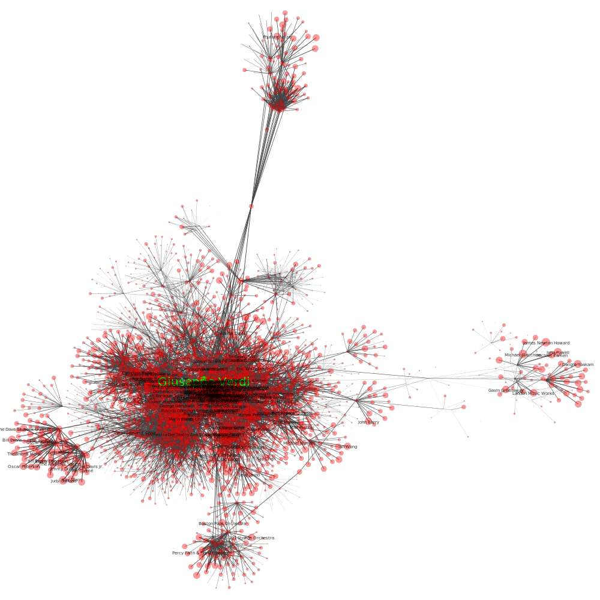

# SpotifyArtistsNetwork

Visualization of related artists on Spotify 

Example use:
python main.py 'Giuseppe Verdi' 5 

## Network of depth three starting from Giuseppe Verdi

## Network of depth four starting from Giuseppe Verdi

